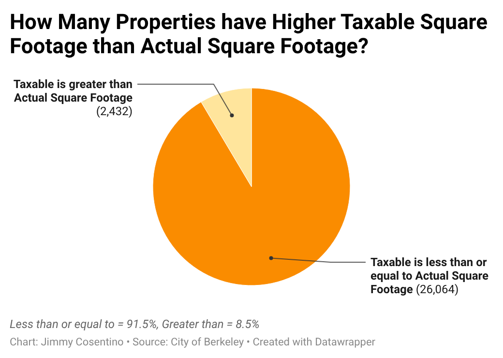
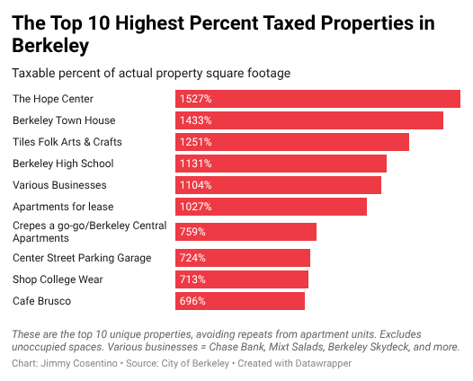
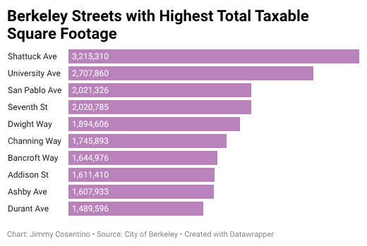

# j124finalproject

# These 10 Places Have the Highest Taxable square footage in Berkeley
Jimmy Cosentino

## Sourcing and Methods

This is my [dataset](https://data.cityofberkeley.info/City-Government/Taxable-Square-Footage/9a47-nj4i/about_data), which I found at the City of Berkeley Open Data Portal (I can't get this link to work for some reason). It is "used to calculate special assessments approved by Berkeley voters in ballot measures," according to the website. Special assessments are fees in addition to taxes, used for one-time or infrequent service, such as repairs or small projects. This data should have no agenda, as it is collected straight from property records, but stretching of the truth or illegal annexing by property owners could slightly alter values.

Here is the [spreadsheet](https://docs.google.com/spreadsheets/d/1o0cjbpv51kzhLz2Pttyn6CsguHwWu1IEPOZ0k0QxZG4/edit?usp=sharing) I have been using in analyzing my data. I've created several pivot tables to investigate chunks of the data, like specific addresses and percent taxable square footage, or just the street with square footage, etc. I also did some filtering to come up with the properties with the highest taxable square footage, which I researched and added to the sheet.

## Interesting findings and *the* 10 places

I examined the data set in a few ways and yielded different results for each. First, I calculated the percent of square footage a property has which is taxable. Surprisingly, 8.5% of these properties have taxable square footage greater than actual square footage. 

The highest percent is just off Shattuck Avenue at [The Hope Center](https://insighthousing.org/what-we-do/the-hope-center-berkeley/) at 1,527%.

Imagine paying 15 times more property tax than the size of your property entails, and when you're a business who provides housing and meals for low-income and impoverished individuals. I can't seem to find any good reason for discrepancies like this, but one possibility that I conjecture is that the assessor calculates and reports only one floor of a rectangular, multi-story building, then multiplies by the stories to calculate the taxable square footage.

The top 10 highest taxable properties were overwhelmingly dominated by units of [Berkeley Town House](https://www.berkeleytownhouse.org/), which is a cooperative apartment complex owned and operated by tenants, exclusive to adults over the age of 55. This building somewhat disproves my initial hypothesis about the calculations, because each specific unit of the apartment is noted within the first 10 data points, and each has 929.41% taxable square footage. Additionally, for the sake of sharing 10 unique businesses, I removed these units aside from their first appearance. I also removed unoccupied spaces within the first 10 data points to focus on properties that are currently operating. 

I also found the 10 highest taxed streets in Berkeley, meaning the 10 streets whose buildings have the highest taxable area in sum.

These numbers seem to proportionally reflect how busy and active the streets are. The top three are Shattuck Ave, University Ave, and San Pablo Ave. Shattuck Avenue north of Downtown Berkeley is the "Gourmet Ghetto," home to famed restaurants like Chez Panisse, Cheeseboard Pizza Collective, and Saul's Delicatessen. University Avenue comprises restaurants, hotels, and apartments as well. San Pablo is densely populated with businesses like the other two.

## Summary, Concerns, and Acknowledgements

This dataset is quite dry, and paints a self-explanatory picture of the city of Berkeley. Some of this data is reassuring, like seeing how some of Berkeley's more expensive regions seem to be paying comparable and fair property taxes, notably Shattuck Avenue. Nevertheless, there are many mom 'n' pop shops around those areas who also pay very expensive property tax.

The discrepancy between actual and taxable square footage is notable, and seems to affect many individual apartment units heavily. I cannot find any good reason for these huge mismatches on the internet. If this project were to continue, I would contact the city and check other city databases to find more evidence of this phenomenon.

## Other Notable Resources

* The City of Berkeley has a [frequently asked questions document](https://berkeleyca.gov/sites/default/files/documents/PropertyTaxFAQs.pdf) about property taxes, which outlines exactly what constitutes as square footage, providing some more insight into the numbers in the dataset.
* In researching, I also found a [restaurant inspections dataset](https://data.acgov.org/datasets/e95ff2829e9d4ea0b3d8266aac37ff14_0/about) for Alameda County. These datasets could be used in tandem to make some observations about restaurant property tax.
